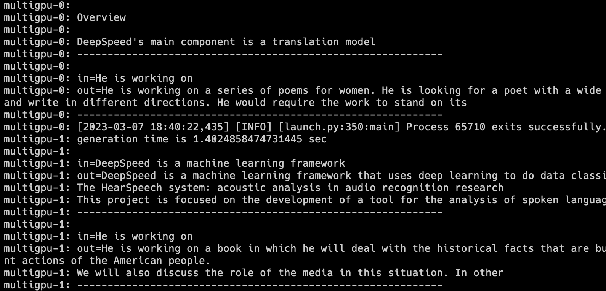

# OCI MultiGPU 

This repo enables you to create a cluster of GPUs instances and configure them to use them with deepspeed, in a multi-node and multi-gpu scenario. It automatically installs the dependencies and configure all the instances so you can immediately use deepspeed for inference or training.

[DeepSpeed](https://github.com/microsoft/DeepSpeed) is an easy-to-use deep learning optimization software suite that enables unprecedented scale and speed for Deep Learning Training and Inference.

## Requirements
- Terraform
- ssh-keygen

## Configuration

1. Follow the instructions to add the authentication to your tenant https://medium.com/@carlgira/install-oci-cli-and-configure-a-default-profile-802cc61abd4f.
2. Clone this repository:
    ```bash
    git clone https://github.com/carlgira/oci-multigpu.git
    ```

3. Set three variables in your path. 
- The tenancy OCID, 
- The comparment OCID where the instance will be created.
- The number of instances to create
- The number of available GPUs in each instance. (get this value according with the shape to use)
- The "Region Identifier" of region of your tenancy.
> **Note**: [More info on the list of available regions here.](https://docs.oracle.com/en-us/iaas/Content/General/Concepts/regions.htm)

```bash
    export TF_VAR_tenancy_ocid='<tenancy-ocid>'
    export TF_VAR_compartment_ocid='<comparment-ocid>'
    export TF_VAR_instance_count=<number-of-instances>
    export TF_VAR_region='<oci-region>'
```

4. If you're using a Linux OS, you may need to execute the following command to obtain execution permissions on the shell script:
```bash
    chmod a+x generate-keys.sh
```
5. Execute the script generate-keys.sh to generate private key to access the instance. 
```bash
    sh generate-keys.sh
```

## Build

To build the terraform solution, simply execute: 

```bash
    terraform init
    terraform plan
    terraform apply
```

## Test
A simple test to run bloom-3b in a GPU cluster using deepspeed. You can run this connecting to one of the instances, and execute deepspeed using the hostfile that contains the information of the cluster.

```bash
    source ~/.venv/bin/activate
    deepspeed --hostfile=/home/opc/multigpu/deepseed-hosts --master_addr multigpu-0.subnet.vcn.oraclevcn.com --master_port 3000 ~/DeepSpeedExamples/inference/huggingface/text-generation/inference-test.py --name bigscience/bloom-3b --batch_size 2
```

At the end you will see the completition of two phrases in each GPU (multigpu-0 and multigpu-1)



## Acknowledgements

* **Author** - [Carlos Giraldo](https://www.linkedin.com/in/carlos-giraldo-a79b073b/), Oracle
* **Last Updated Date** - March 7th, 2023
